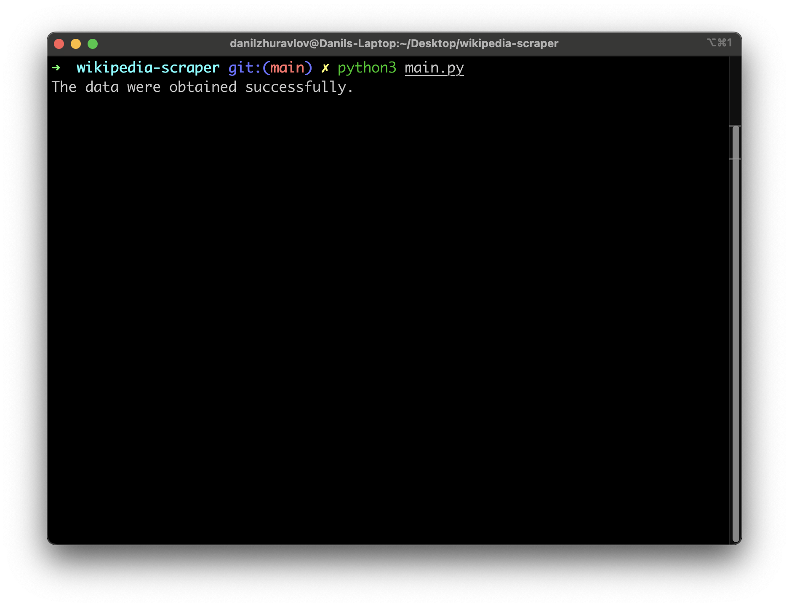

# Wikipedia Scraper 🌐

## Description 🔍

The Wikipedia Scraper is a Python tool designed to retrieve information about political leaders from a specific API and their corresponding Wikipedia pages. It fetches data such as the leader's name, birth date, and a short introduction paragraph from Wikipedia, storing the collected information in a structured JSON format.

## Installation ⚙️
    git clone git@github.com:Danil-Zhuravlov/wikipedia-scraper.git
    cd wikipedia-scraper
    pip install -r requirements.txt

## Usage 💡

### Running the Scraper
To use the Wikipedia Scraper, execute the following command in your terminal:

    python main.py

This initiates the scraper, which queries the API for supported countries, fetches leaders' data, retrieves introductory paragraphs from Wikipedia, and saves the output in a JSON file.

### Scraper Configuration

No additional configuration is required to start using the Wikipedia Scraper. The tool is designed to be ready to use immediately after installation.

## Visuals 🖼️

### Example of usage:

### Leaders' info from a JSON File example:

    {
            "id": "Q9640",
            "first_name": "Lyndon",
            "last_name": "Johnson",
            "birth_date": "1908-08-27",
            "death_date": "1973-01-22",
            "place_of_birth": "Stonewall",
            "wikipedia_url": "https://en.wikipedia.org/wiki/Lyndon_B._Johnson",
            "start_mandate": "1963-11-22",
            "end_mandate": "1969-01-20",
            "wikipedia_intro": "Lyndon Baines Johnson, often referred to by his initials LBJ, was an American politician who served as the 36th president of the United States from 1963 to 1969. He became president after the assassination of John F. Kennedy, under whom he had served as the 37th vice president from 1961 to 1963. A Democrat from Texas, Johnson also served as a U.S. representative and U.S. senator."
        },
## Timeline ⏳
Project took 3 days.

## Personal Situation 👤

As I embarked on my journey at BeCode.org, this project became an important chapter in my learning experience. The Wikipedia Scraper pushed me to improve my webscraping and programming skills, testing my abilities in real-life examples. Beyond just writing lines of code, it was a genuine test of problem-solving, as I sought to create a tool with practical utility. In the span of just three days, this project not only deepened my understanding but also became a tangible representation of my growth. It's a genuine reflection of the strides I've made, standing as a testament to my dedication and progress in the world of data science and coding.

## License 📝
This project is licensed under the MIT License - see the [LICENSE.txt](LICENSE.txt) file for details.

## Connect with Me 💬

For more information about my projects and professional background, connect with me on [LinkedIn](https://www.linkedin.com/in/danil-zhuravlov/)
